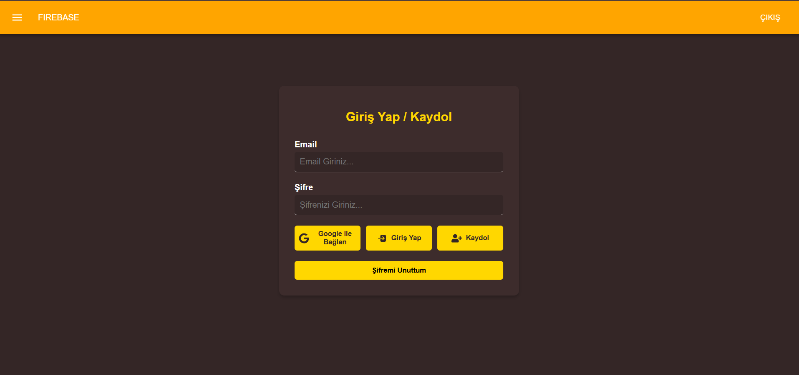
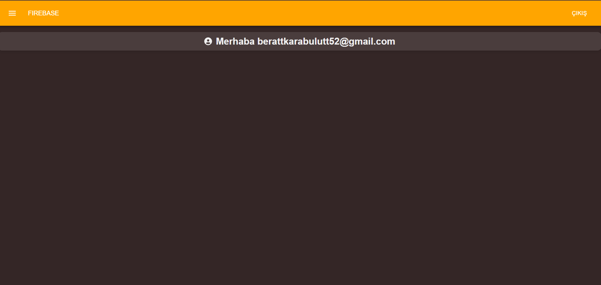

# 🚀 React + Firebase Authentication App

A modern authentication system with **React**, **Firebase**, and **Material UI**. This application allows users to register, log in with Google, and reset their passwords. It also includes form validation using **Formik** and **Yup** for seamless user interaction. The app is fully responsive and optimized for all screen sizes!

---

## 🚀 Features

- 📌 **User Registration**: Users can create an account via email and password.
- 🔑 **Login with Google**: Easy authentication with Google sign-in.
- 🔒 **Password Reset**: Users can reset their passwords via email.
- 🖥️ **Responsive Design**: Fully optimized for both desktop and mobile views.
- ✅ **Form Validation**: Seamless user experience with **Formik** and **Yup**.
- 📩 **Toast Notifications**: Real-time notifications for user actions using **Toastify**.

---

## 📸 Preview




---

## 🛠️ Tech Stack

- **React** ⚛️
- **Firebase** 🔥
- **Material UI (MUI)** 🖌️
- **Formik** 📄
- **Yup** 📏
- **React Router** 🌍
- **Toastify** 🍞

---

## 🚀 How to Run the Project
1. Extract the file from the ZIP archive.

2. Navigate to the project directory:
   ```bash
   cd firebase-login
   ```

3. Install dependencies:
   ```bash
   npm install
   ```

4. Start the development server:
   ```bash
   npm run dev
   ```
